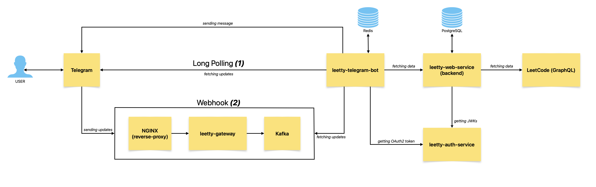

# leetty
- [Description](#description)
- [Architecture](#architecture)
  - [leetty-auth-service](#leetty-auth-service)
  - [leetty-web-service](#leetty-web-service)
  - [leetty-telegram-bot](#leetty-telegram-bot)
  - [leetty-gateway](#leetty-gateway)
- [How to try it?](#how-to-try-it)
- [Can I deploy it by myself? How?](#can-i-deploy-it-by-myself-how)
- [Afterword](#afterword)
## Description
**_in progress_**
## Architecture

### leetty-auth-service
**_in progress_**
### leetty-web-service
**_in progress_**
### leetty-telegram-bot
**_in progress_**
### leetty-gateway
**_in progress_**

## How to try it?
You can try it by following the link: https://t.me/LeettyBot

## Can I deploy it by myself? How?
**_in progress_**
## Afterword
**_in progress_**